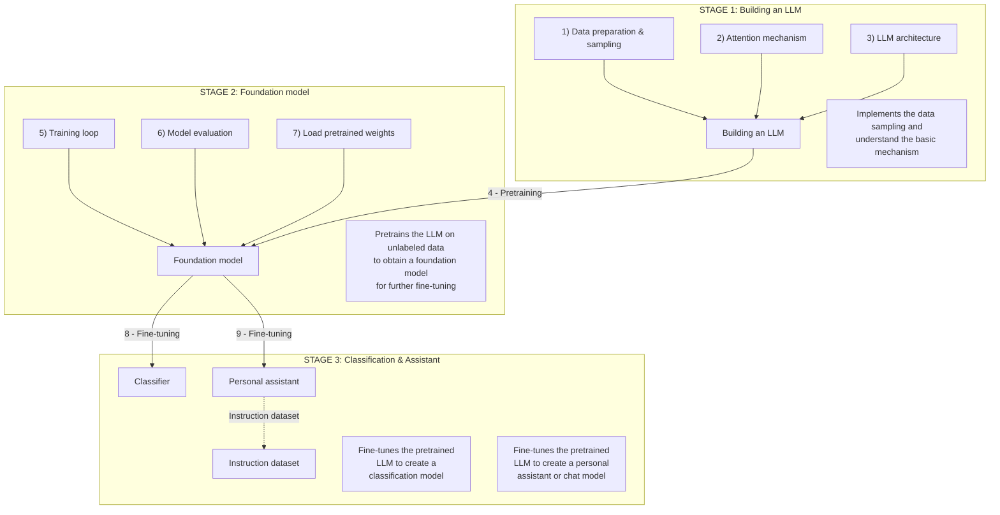

```text
   ===================
   | @@@@----@ | --@@ |    
   | @@@----@@ | --@@ |           _                          _     _     __  __ 
   | @@----@@@ | --@@ |      __ _| |__   __ _  ___ _   _ ___| |   | |   |  \/  |     
   | @----@@@@ | --@@ |     / _` | '_ \ / _` |/ __| | | / __| |   | |   | |\/| | 
   | @@@@@---- | @--@ |    | (_| | |_) | (_| | (__| |_| \__ \ |___| |___| |  | |     
   | @@@@----@ | @--@ |     \__,_|_.__/ \__,_|\___|\__,_|___/_____|_____|_|  |_|                                                   
   ===================
```
## Overview

This project explores building language models from scratch, implementing various neural network architectures and training techniques. It's designed as a learning tool to understand the fundamentals of large language models.

## Features

- PyTorch-based implementations
- TensorFlow support for alternative backends
- Jupyter notebook experimentation environment
- Visualization tools for model analysis
- Cross-platform compatibility (macOS, Linux, Windows)

## Project Pipeline



### Project Stages

- [ ] **Stage 1: Building an LLM** - Implements the data sampling and understand the basic mechanism
  - [X] 1) Data preparation & sampling
  - [ ] 2) Attention mechanism
  - [ ] 3) LLM architecture
  - [ ] 4) Pretraining

- [ ] **Stage 2: Foundation model** - Pretrains the LLM on unlabeled data to obtain a foundation model for further fine-tuning
  - [ ] 5) Training loop
  - [ ] 6) Model evaluation
  - [ ] 7) Load pretrained weights

- [ ] **Stage 3: Classification & Assistant** - Fine-tunes the pretrained LLM to create specialized models
  - [ ] 8) Fine-tuning Classifier
  - [ ] 9) Fine-tuning Personal assistant

## Installation

### Prerequisites

- Python 3.10+
- [uv](https://github.com/astral-sh/uv) - Fast Python package installer and resolver

### Setup

1. Clone the repository:
```bash
git clone <repository-url>
cd abacus-llm
```

2. Install dependencies with uv:
```bash
uv sync
```

This will create a virtual environment and install all dependencies from the lock file.

## License

See [LICENSE](LICENSE) for details.

## Citations & Acknowledgments

Raschka, S. (2025) Build a Large Language Model (From Scratch). Manning Publications. Available at: https://www.manning.com/books/build-a-large-language-model-from-scratch.